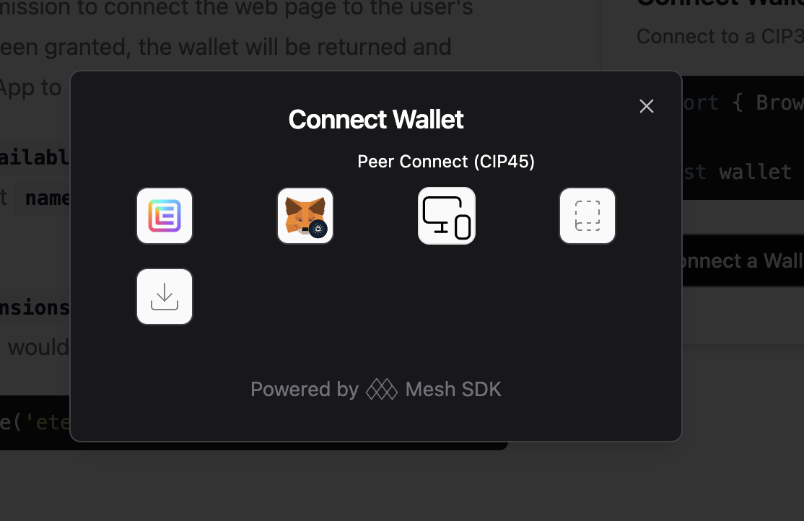
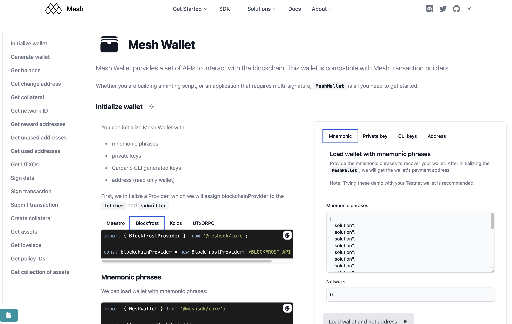

## Finalised Mesh <> CIP 45: Set up dApp peer module

Here is a [demo](./assets/cip45.mov) of how CIP 45 works end-to-end using the latest React UI component.

## Finalised Mesh Wallet: Finalise all wallet endpoints

All endpoints can be found here: https://meshjs.dev/apis/wallets/meshwallet

## Finalised Mesh Wallet: Yaci support development

Mesh Wallet is fully compatible with Yaci node. All transactions (with custom protocol parameters) can be signed by Mesh Wallet:
https://meshjs.dev/yaci/transactions
